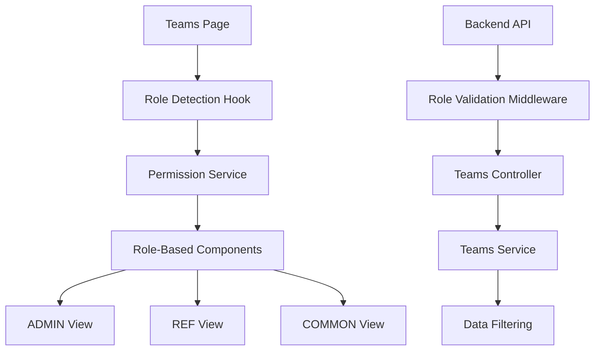

# Design Document

## Overview

This design implements role-based access control for the teams page, providing different views and capabilities based on user roles (ADMIN, REF, COMMON). The solution leverages the existing authentication system and extends it with role-specific UI components and data filtering.

## Architecture

### High-Level Architecture



### Component Structure

The teams page will be restructured to use a role-based component system:

- **TeamsPageContainer**: Main container that detects user role and renders appropriate view
- **AdminTeamsView**: Full CRUD operations, import/export functionality
- **RefTeamsView**: Read-only access to all team information
- **CommonTeamsView**: Limited view showing only user's team and basic info of others

## Components and Interfaces

### 1. Role Detection and Permission Management

```typescript
// Hook for role-based access control
interface UseRoleBasedTeamsAccess {
  userRole: UserRole | null;
  canCreateTeams: boolean;
  canEditTeams: boolean;
  canDeleteTeams: boolean;
  canImportExport: boolean;
  canViewAllTeams: boolean;
  canViewTeamDetails: boolean;
  userTeam: Team | null;
  filteredTeams: Team[];
}

// Permission service for teams
interface TeamsPermissionService {
  getTeamsForRole(userRole: UserRole, userId: string, teams: Team[]): Team[];
  getTeamColumnsForRole(userRole: UserRole): TeamColumn[];
  canPerformAction(userRole: UserRole, action: TeamAction): boolean;
}
```

### 2. Role-Specific Components

```typescript
// Admin view with full functionality
interface AdminTeamsViewProps {
  tournaments: Tournament[];
  selectedTournamentId: string;
  onTournamentChange: (id: string) => void;
  teams: Team[];
  onImport: (data: ImportData) => void;
  onExport: () => void;
  onCreateTeam: (team: CreateTeamDto) => void;
  onUpdateTeam: (team: UpdateTeamDto) => void;
  onDeleteTeam: (id: string) => void;
}

// Referee view with read-only access
interface RefTeamsViewProps {
  tournaments: Tournament[];
  selectedTournamentId: string;
  onTournamentChange: (id: string) => void;
  teams: Team[];
  columns: TeamColumn[];
}

// Common user view with limited access
interface CommonTeamsViewProps {
  userTeam: Team | null;
  otherTeams: Team[];
  limitedColumns: TeamColumn[];
}
```

### 3. Data Filtering and Column Configuration

```typescript
// Column configuration based on role
interface TeamColumnConfig {
  [UserRole.ADMIN]: TeamColumn[];
  [UserRole.HEAD_REFEREE]: TeamColumn[];
  [UserRole.ALLIANCE_REFEREE]: TeamColumn[];
  [UserRole.COMMON]: TeamColumn[];
}

// Data filtering service
interface TeamDataFilter {
  filterTeamsForRole(teams: Team[], userRole: UserRole, userId: string): Team[];
  filterTeamDetailsForRole(team: Team, userRole: UserRole, userId: string): Partial<Team>;
}
```

## Data Models

### Extended Team Model

```typescript
interface Team {
  id: string;
  name: string;
  code: string;
  organization: string;
  description: string;
  members: TeamMember[];
  tournamentId: string;
  createdBy: string;
  createdAt: Date;
  updatedAt: Date;
  // Role-specific fields
  isUserTeam?: boolean; // Computed field for COMMON users
  publicInfo?: PublicTeamInfo; // Limited info for COMMON users
}

interface TeamMember {
  id: string;
  userId: string;
  teamId: string;
  role: TeamMemberRole;
  user: {
    id: string;
    name: string;
    email?: string; // Only visible to ADMIN and team members
  };
}

interface PublicTeamInfo {
  name: string;
  organization: string;
  memberCount: number;
}
```

### Role-Based API Responses

```typescript
// Different response types based on role
interface AdminTeamResponse extends Team {
  // Full team data including sensitive information
  members: TeamMember[];
  statistics: TeamStatistics;
  auditLog: AuditEntry[];
}

interface RefTeamResponse {
  id: string;
  name: string;
  code: string;
  organization: string;
  description: string;
  members: PublicTeamMember[];
  statistics: TeamStatistics;
}

interface CommonTeamResponse {
  id: string;
  name: string;
  organization: string;
  memberCount: number;
  // Only full details if it's user's own team
  members?: TeamMember[];
  description?: string;
}
```

## Error Handling

### Frontend Error Handling

```typescript
interface TeamErrorHandler {
  handleUnauthorizedAccess(): void;
  handleInsufficientPermissions(action: string): void;
  handleTeamNotFound(): void;
  handleImportErrors(errors: ImportError[]): void;
}
```

### Backend Error Responses

```typescript
interface RoleBasedErrorResponse {
  statusCode: number;
  message: string;
  error: string;
  requiredRole?: UserRole[];
  userRole?: UserRole;
  action?: string;
}
```

## Testing Strategy

### Unit Tests

1. **Role Detection Tests**
   - Test role detection from auth context
   - Test permission calculation for each role
   - Test data filtering logic

2. **Component Tests**
   - Test each role-specific view renders correctly
   - Test action buttons are shown/hidden based on role
   - Test data display matches role permissions

3. **Permission Service Tests**
   - Test team filtering for each role
   - Test column configuration for each role
   - Test action permissions for each role

### Integration Tests

1. **API Integration Tests**
   - Test backend role validation
   - Test data filtering at API level
   - Test error responses for unauthorized actions

2. **End-to-End Tests**
   - Test complete user flows for each role
   - Test role switching scenarios
   - Test unauthorized access attempts

### Role-Specific Test Scenarios

```typescript
describe('Teams Page Role-Based Access', () => {
  describe('ADMIN Role', () => {
    it('should show all CRUD operations');
    it('should show import/export buttons');
    it('should display all team data');
    it('should allow team creation');
    it('should allow team deletion');
  });

  describe('REF Role', () => {
    it('should show read-only view');
    it('should hide CRUD operations');
    it('should hide import/export buttons');
    it('should display all team data');
  });

  describe('COMMON Role', () => {
    it('should show only user team and limited other team info');
    it('should hide all management operations');
    it('should show team member details for own team');
    it('should show limited info for other teams');
  });
});
```

## Implementation Phases

### Phase 1: Backend Role Validation
- Extend teams controller with role-based endpoints
- Implement data filtering service
- Add role validation middleware
- Create role-specific response DTOs

### Phase 2: Frontend Permission System
- Create role-based access hook
- Implement permission service
- Create team data filtering utilities
- Add role-specific column configurations

### Phase 3: Role-Specific Components
- Create AdminTeamsView component
- Create RefTeamsView component  
- Create CommonTeamsView component
- Implement TeamsPageContainer with role routing

### Phase 4: Integration and Testing
- Integrate components with existing hooks
- Add comprehensive test coverage
- Implement error handling
- Add loading states and user feedback

## Security Considerations

### Frontend Security
- Role validation happens on every page load
- Sensitive UI elements are conditionally rendered
- API calls include role validation
- Client-side filtering as additional layer (not primary security)

### Backend Security
- All endpoints validate user role server-side
- Data filtering happens at service layer
- Audit logging for sensitive operations
- Rate limiting for import/export operations

### Data Privacy
- COMMON users only see public team information
- Email addresses hidden from non-team members
- Sensitive team data restricted to ADMIN/REF roles
- User's own team data always accessible to them