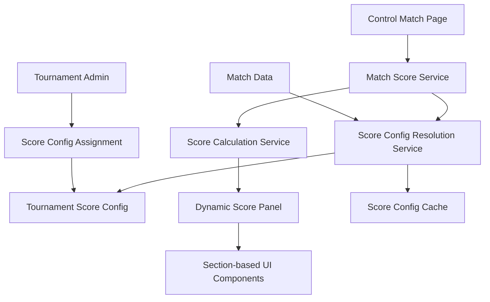

# Design Document

## Overview

This design implements the integration of score-config profiles with tournament matches and the control-match page. The solution builds upon the existing score-config system to ensure that matches automatically use their tournament's assigned score-config and that the control panel dynamically adapts to display the appropriate scoring interface.

The design leverages the existing relationship between `Tournament` and `ScoreConfig` models, and extends the current scoring services to automatically resolve and apply the correct score configuration for each match.

## Architecture

### High-Level Architecture



### Component Relationships

1. **Score Config Resolution**: Automatically determines which score-config to use for a given match
2. **Dynamic Score Panel**: Renders scoring interface based on the resolved score-config
3. **Enhanced Score Calculation**: Uses tournament-specific score-config for all calculations
4. **Backward Compatibility Layer**: Ensures existing functionality continues to work

## Components and Interfaces

### Backend Components

#### 1. Score Config Resolution Service

**Purpose**: Resolves the appropriate score-config for any given match

```typescript
interface IScoreConfigResolutionService {
  resolveScoreConfigForMatch(matchId: string): Promise<ScoreConfig | null>;
  getScoreConfigWithPreview(scoreConfigId: string): Promise<ScoreConfigPreview>;
  validateScoreConfigForTournament(scoreConfigId: string, tournamentId: string): Promise<ValidationResult>;
}
```

**Key Methods**:
- `resolveScoreConfigForMatch()`: Gets score-config via match → stage → tournament relationship
- `getScoreConfigWithPreview()`: Returns score-config with UI preview data
- `validateScoreConfigForTournament()`: Ensures score-config is compatible with tournament

#### 2. Enhanced Match Scores Controller

**Purpose**: Extends existing match scoring to use tournament score-configs

**New Endpoints**:
- `GET /match-scores/:matchId/score-config` - Get score-config for a specific match
- `GET /match-scores/:matchId/score-panel-config` - Get UI configuration for score panel
- `POST /match-scores/:matchId/:allianceId/calculate-preview` - Preview score calculation

#### 3. Score Config Preview Service

**Purpose**: Generates preview data for score-config UI rendering

```typescript
interface ScoreConfigPreview {
  sections: SectionPreview[];
  totalFormulaPreview: string;
  validationErrors: ValidationError[];
  sampleCalculation: CalculationExample;
}

interface SectionPreview {
  id: string;
  name: string;
  code: string;
  elements: ElementPreview[];
  bonuses: BonusPreview[];
  penalties: PenaltyPreview[];
  displayOrder: number;
}
```

### Frontend Components

#### 1. Dynamic Score Panel Component

**Purpose**: Renders scoring interface based on tournament's score-config

```typescript
interface DynamicScorePanelProps {
  matchId: string;
  allianceColor: 'RED' | 'BLUE';
  onScoreChange: (scores: ElementScores) => void;
  onSubmit: (finalScores: FinalScores) => void;
}
```

**Features**:
- Automatically fetches score-config for the match
- Renders sections in display order
- Handles real-time score calculation
- Shows bonus/penalty conditions dynamically

#### 2. Score Section Component

**Purpose**: Renders individual scoring sections (auto, teleop, endgame, etc.)

```typescript
interface ScoreSectionProps {
  section: SectionConfig;
  scores: ElementScores;
  onScoreChange: (elementCode: string, value: number) => void;
  readonly?: boolean;
}
```

#### 3. Score Config Preview Component

**Purpose**: Shows administrators how their score-config will appear in the control panel

```typescript
interface ScoreConfigPreviewProps {
  scoreConfigId: string;
  showSampleData?: boolean;
  interactive?: boolean;
}
```

## Data Models

### Enhanced Score Config Model

The existing `ScoreConfig` model already supports the required relationships. Key fields:

```typescript
interface ScoreConfig {
  id: string;
  tournamentId?: string; // Links to tournament
  name: string;
  description?: string;
  totalScoreFormula?: string; // Formula for calculating total score
  scoreSections: ScoreSection[]; // Organized sections
  scoreElements: ScoreElement[]; // Legacy elements
  bonusConditions: BonusCondition[]; // Legacy bonuses
  penaltyConditions: PenaltyCondition[]; // Legacy penalties
}
```

### Score Panel Configuration Model

New model for frontend configuration:

```typescript
interface ScorePanelConfig {
  matchId: string;
  scoreConfigId: string;
  sections: SectionConfig[];
  formula: string;
  previewMode: boolean;
  validationRules: ValidationRule[];
}

interface SectionConfig {
  id: string;
  name: string;
  code: string;
  displayOrder: number;
  elements: ElementConfig[];
  bonuses: BonusConfig[];
  penalties: PenaltyConfig[];
}
```

## Error Handling

### Backend Error Scenarios

1. **No Score Config Found**: 
   - Fallback to legacy scoring method
   - Log warning for tournament admin
   - Continue with basic auto/teleop scoring

2. **Invalid Score Config**:
   - Return validation errors
   - Prevent score submission until fixed
   - Provide clear error messages

3. **Formula Evaluation Errors**:
   - Catch and handle formula parsing errors
   - Provide fallback calculation method
   - Log errors for debugging

### Frontend Error Handling

1. **Score Config Loading Failures**:
   - Show loading state with retry option
   - Fallback to basic scoring interface
   - Display error message to user

2. **Real-time Calculation Errors**:
   - Show last valid calculation
   - Highlight problematic inputs
   - Allow manual score entry as fallback

## Testing Strategy

### Backend Testing

1. **Unit Tests**:
   - Score config resolution logic
   - Formula evaluation with various inputs
   - Backward compatibility scenarios
   - Error handling paths

2. **Integration Tests**:
   - End-to-end match scoring flow
   - Tournament score-config assignment
   - Database relationship integrity
   - API endpoint functionality

3. **Performance Tests**:
   - Score config resolution speed
   - Real-time calculation performance
   - Database query optimization

### Frontend Testing

1. **Component Tests**:
   - Dynamic score panel rendering
   - Section-based UI components
   - Score calculation accuracy
   - User interaction handling

2. **Integration Tests**:
   - Score submission flow
   - Real-time score updates
   - Error state handling
   - Preview functionality

3. **E2E Tests**:
   - Complete match scoring workflow
   - Admin score-config preview
   - Tournament assignment flow
   - Cross-browser compatibility

### Test Data Strategy

1. **Score Config Variations**:
   - Simple section-based configs
   - Complex formula-based configs
   - Legacy element-only configs
   - Mixed section/legacy configs

2. **Tournament Scenarios**:
   - Tournaments with assigned score-configs
   - Tournaments without score-configs
   - Multiple tournaments sharing configs
   - Score-config updates during tournaments

## Implementation Phases

### Phase 1: Backend Score Config Resolution
- Implement score config resolution service
- Extend match scores controller with new endpoints
- Add score config preview functionality
- Ensure backward compatibility

### Phase 2: Frontend Dynamic Score Panel
- Create dynamic score panel component
- Implement section-based UI rendering
- Add real-time score calculation
- Integrate with existing control-match page

### Phase 3: Admin Preview and Management
- Add score config preview to admin panel
- Implement validation and error handling
- Create assignment management interface
- Add testing and debugging tools

### Phase 4: Testing and Optimization
- Comprehensive testing across all scenarios
- Performance optimization
- User experience refinements
- Documentation and training materials