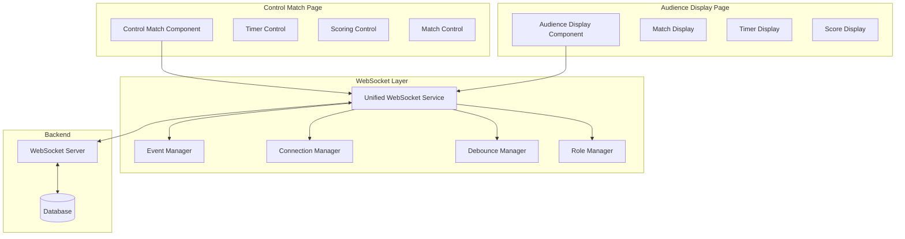
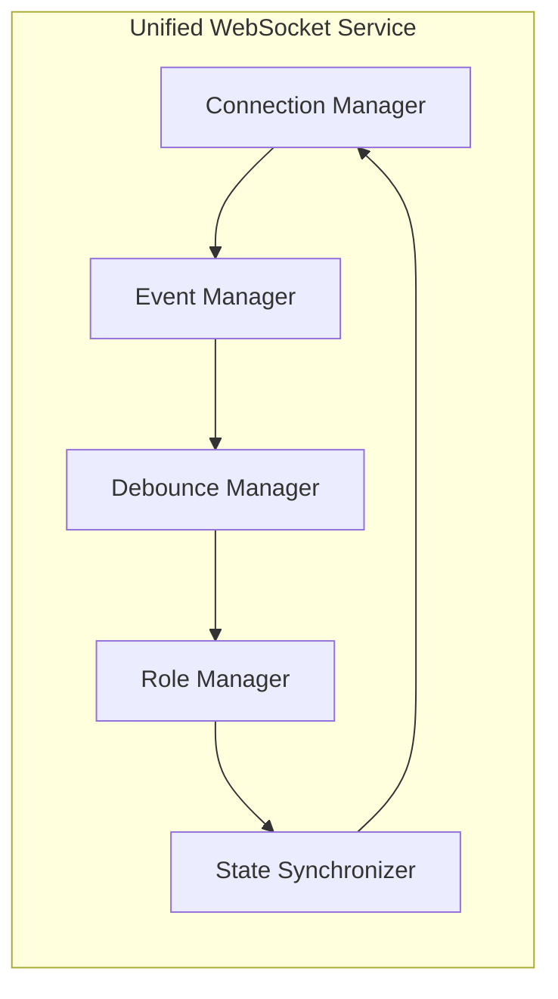

# Design Document

## Overview

This design establishes a unified WebSocket architecture that eliminates the current dual-service conflicts and provides reliable real-time synchronization between control-match and audience-display pages. The solution implements a single WebSocket service with proper debouncing, role-based access control, and multi-user collaboration support.

## Architecture

### High-Level Architecture



### WebSocket Service Architecture



## Components and Interfaces

### 1. Unified WebSocket Service

**Purpose**: Single point of WebSocket communication, replacing the dual service architecture.

**Key Methods**:
```typescript
interface IUnifiedWebSocketService {
  // Connection Management
  connect(url?: string): Promise<void>;
  disconnect(): void;
  isConnected(): boolean;
  getConnectionStatus(): ConnectionStatus;
  
  // Event Management with Debouncing
  emit(event: string, data: any, options?: EmitOptions): void;
  on<T>(event: string, callback: (data: T) => void): () => void;
  
  // Specialized Methods
  sendTimerUpdate(data: TimerData): void;
  sendScoreUpdate(data: ScoreData): void;
  sendMatchUpdate(data: MatchData): void;
  
  // Role-based Access
  setUserRole(role: UserRole): void;
  canAccess(feature: string): boolean;
  
  // Multi-user Support
  joinCollaborativeSession(matchId: string): void;
  leaveCollaborativeSession(matchId: string): void;
}
```

### 2. Connection Manager

**Purpose**: Handles WebSocket connection lifecycle with robust error recovery.

**Features**:
- Single connection per client
- Exponential backoff reconnection (max 5 attempts)
- Connection state tracking
- Automatic state resync on reconnection

**Implementation**:
```typescript
class ConnectionManager {
  private socket: Socket | null = null;
  private reconnectAttempts = 0;
  private readonly maxReconnectAttempts = 5;
  private connectionState: ConnectionState;
  
  async connect(url?: string): Promise<void>;
  disconnect(): void;
  private handleReconnection(): void;
  private syncStateOnReconnect(): void;
}
```

### 3. Event Manager

**Purpose**: Centralized event handling with deduplication and filtering.

**Features**:
- Single event handler per event type
- Field/tournament filtering
- Event deduplication
- Error boundary protection

**Implementation**:
```typescript
class EventManager {
  private eventHandlers: Map<string, Set<EventHandler>>;
  private masterHandlers: Map<string, MasterHandler>;
  
  on<T>(event: string, callback: (data: T) => void): () => void;
  emit(event: string, data: any): void;
  private createMasterHandler(event: string): MasterHandler;
  private filterEvent(event: string, data: any): boolean;
}
```

### 4. Debounce Manager

**Purpose**: Rate limiting and debouncing for high-frequency events.

**Features**:
- Score updates: max 10/second
- Timer updates: max 1/second
- Event deduplication
- Latest data preservation

**Implementation**:
```typescript
class DebounceManager {
  private debounceTimers: Map<string, NodeJS.Timeout>;
  private rateLimits: Map<string, RateLimit>;
  
  debounce(key: string, fn: Function, delay: number): void;
  rateLimit(key: string, fn: Function, maxCalls: number, window: number): void;
  private shouldDebounce(eventType: string): boolean;
}
```

### 5. Role Manager

**Purpose**: Role-based access control for WebSocket events and UI features.

**Features**:
- Role validation for events
- UI feature access control
- Dynamic permission updates

**Implementation**:
```typescript
class RoleManager {
  private currentRole: UserRole;
  private permissions: Map<UserRole, Set<string>>;
  
  setRole(role: UserRole): void;
  canAccess(feature: string): boolean;
  filterEventsByRole(events: WebSocketEvent[]): WebSocketEvent[];
}
```

### 6. State Synchronizer

**Purpose**: Maintains consistent state across multiple clients and handles conflicts.

**Features**:
- Multi-user state synchronization
- Conflict resolution using timestamps
- State recovery on reconnection

**Implementation**:
```typescript
class StateSynchronizer {
  private currentState: MatchState;
  private stateHistory: StateHistory[];
  
  syncState(newState: Partial<MatchState>): void;
  resolveConflict(localState: MatchState, remoteState: MatchState): MatchState;
  getStateSnapshot(): MatchState;
}
```

## Data Models

### WebSocket Event Structure

```typescript
interface WebSocketEvent {
  type: string;
  data: any;
  timestamp: number;
  userId?: string;
  role?: UserRole;
  fieldId?: string;
  tournamentId?: string;
  sessionId?: string;
}
```

### Timer Data Model

```typescript
interface TimerData {
  duration: number;
  remaining: number;
  isRunning: boolean;
  period: 'auto' | 'teleop' | 'endgame';
  startedAt?: number;
  fieldId?: string;
  tournamentId: string;
}
```

### Score Data Model

```typescript
interface ScoreData {
  matchId: string;
  tournamentId: string;
  fieldId?: string;
  redAutoScore: number;
  redDriveScore: number;
  redTotalScore: number;
  blueAutoScore: number;
  blueDriveScore: number;
  blueTotalScore: number;
  redPenalty: number;
  bluePenalty: number;
  timestamp: number;
  userId?: string;
}
```

### Match State Model

```typescript
interface MatchState {
  matchId: string;
  matchNumber: number;
  status: MatchStatus;
  currentPeriod: string;
  redTeams: Team[];
  blueTeams: Team[];
  fieldId?: string;
  tournamentId: string;
  timer: TimerData;
  scores: ScoreData;
  lastUpdated: number;
  activeUsers: string[];
}
```

## Error Handling

### Connection Error Recovery

1. **Connection Loss**: Automatic reconnection with exponential backoff
2. **Event Failures**: Retry mechanism with queue persistence
3. **State Conflicts**: Timestamp-based resolution
4. **Role Violations**: Graceful degradation with user notification

### Error Boundaries

```typescript
class WebSocketErrorBoundary {
  private errorHandlers: Map<string, ErrorHandler>;
  
  handleError(error: WebSocketError): void;
  private logError(error: WebSocketError): void;
  private notifyUser(error: WebSocketError): void;
  private attemptRecovery(error: WebSocketError): void;
}
```

## Testing Strategy

### Unit Tests

1. **Connection Manager**: Connection lifecycle, reconnection logic
2. **Event Manager**: Event handling, filtering, deduplication
3. **Debounce Manager**: Rate limiting, debouncing accuracy
4. **Role Manager**: Permission validation, access control
5. **State Synchronizer**: Conflict resolution, state consistency

### Integration Tests

1. **Multi-client Synchronization**: Timer, scores, match state sync
2. **Role-based Access**: Feature access based on user roles
3. **Network Resilience**: Connection loss and recovery scenarios
4. **Performance**: High-frequency event handling

### End-to-End Tests

1. **Control-Audience Sync**: Complete workflow from control to display
2. **Multi-user Collaboration**: Multiple referees controlling same match
3. **Field Isolation**: Events properly filtered by field
4. **Error Recovery**: System behavior during network issues

### Performance Benchmarks

- **Event Latency**: < 200ms for score updates, < 100ms for timer updates
- **Memory Usage**: < 50MB for WebSocket service
- **CPU Usage**: < 5% during normal operation
- **Network Bandwidth**: < 1KB/s per active connection

## Migration Strategy

### Phase 1: Service Consolidation
- Remove duplicate WebSocket service
- Implement unified service
- Maintain backward compatibility

### Phase 2: Enhanced Features
- Add debouncing and rate limiting
- Implement role-based access control
- Add multi-user support

### Phase 3: Optimization
- Performance tuning
- Advanced error handling
- Monitoring and analytics

## Security Considerations

1. **Authentication**: Validate user roles on connection
2. **Authorization**: Enforce role-based access to events
3. **Data Validation**: Sanitize all incoming WebSocket data
4. **Rate Limiting**: Prevent abuse through excessive event emission
5. **Session Management**: Secure collaborative session handling